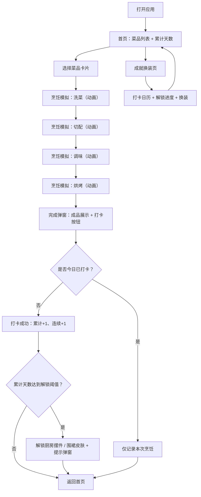

## 1. 产品概述

一人食治愈烹饪 Web 应用 —— 为独居/忙碌用户打造的轻量级烹饪模拟体验。用户选择快手菜后，通过洗菜、切配、调味、烘烤四步交互式动画，完成虚拟烹饪并打卡，累计天数解锁厨房摆件与围裙皮肤。核心价值：降低做饭心理门槛，用治愈感微交互培养用户的烹饪习惯。

## 2. 核心功能

### 2.1 用户角色
| 角色 | 注册方式 | 核心权限 |
|------|----------|----------|
| 普通用户 | 无需注册（本地存储） | 选择菜品、模拟烹饪、打卡、解锁装饰品 |

### 2.2 功能模块
1. **首页（菜品选择）**：菜品卡片网格、累计天数展示、已解锁装饰入口
2. **烹饪模拟页**：步骤进度条、四步交互（洗菜/切配/调味/烘烤）、每步动画反馈
3. **打卡与成就页**：打卡按钮、连续天数、解锁进度、厨房摆件 & 围裙皮肤换装预览

### 2.3 页面详情
| 页面名称 | 模块名称 | 功能描述 |
|----------|----------|----------|
| 首页 | 顶部状态栏 | 显示累计打卡天数、今日是否打卡、连续打卡天数 |
| 首页 | 菜品卡片网格 | 6 道快手菜卡片，hover 微动效，点击进入烹饪页 |
| 首页 | 装饰入口 | 入口按钮，跳转至成就/换装页 |
| 烹饪模拟页 | 步骤进度条 | 4 步进度指示，当前步骤高亮，已完成步骤打勾 |
| 烹饪模拟页 | 洗菜环节 | 点击/拖动水流图标清洗食材，溅水粒子动画 |
| 烹饪模拟页 | 切配环节 | 点击刀块切菜，食材分段动画+音效反馈感 |
| 烹饪模拟页 | 调味环节 | 拖拽调料瓶撒粉/倒油，下落粒子动画 |
| 烹饪模拟页 | 烘烤环节 | 烤箱开关门动画 + 计时进度 + 温度上升动效 |
| 烹饪模拟页 | 完成弹窗 | 成品展示 + 打卡按钮 |
| 成就换装页 | 打卡日历 | 月度打卡日历视图，已打卡日期高亮 |
| 成就换装页 | 解锁进度 | 各解锁阈值列表 + 进度条 |
| 成就换装页 | 厨房摆件 | 已解锁 / 未解锁摆件网格，已解锁可切换摆放 |
| 成就换装页 | 围裙皮肤 | 皮肤选择，切换后烹饪页角色围裙变化 |

## 3. 核心流程

用户打开应用 → 首页浏览菜品（查看累计天数）→ 点击菜品卡片 → 进入烹饪模拟页 → 依次完成洗菜→切配→调味→烘烤（每步动画反馈）→ 弹出完成页 → 点击打卡（今日天数+1，写入本地）→ 检查是否触发解锁奖励 → 返回首页或继续换装。

## 4. 用户界面设计

### 4.1 设计风格
- **主色**：暖杏色 `#FFE8D6` 作为背景主色，搭配蜜橘橙 `#FF8C42` 作为主按钮与强调色
- **辅色**：抹茶绿 `#A7C957`（健康/蔬菜）、奶油米白 `#FFF8F0`、深棕 `#6B4226`（文字主色）
- **按钮风格**：大圆角 20px，微 3D 凸起阴影，按下有下陷反馈
- **字体**：标题用「ZCOOL KuaiLe / 站酷快乐体」（手写可爱感），正文用「Noto Sans SC / 思源黑体」
- **布局风格**：卡片式网格布局，大留白，圆角卡片，轻微投影
- **图标风格**：手绘风 Emoji + SVG 线条图标，柔和圆润
- **整体氛围**：温暖治愈、厨房烟火气、轻微拟物 + 扁平混搭

### 4.2 页面设计概览
| 页面名称 | 模块名称 | UI 元素 |
|----------|----------|---------|
| 首页 | 顶部状态栏 | 米色胶囊卡片，左侧日历图标+累计天数，右侧围裙皮肤缩略图 |
| 首页 | Hero 标题区 | 大号手写字体「一人食 · 治愈小厨房」，副标题柔和阴影，底部蒸汽漂浮动画 |
| 首页 | 菜品卡片网格 | 2 列网格，卡片含菜品图、菜名标签、难度星数（★）、时长（15min），hover 轻微上浮 |
| 烹饪模拟页 | 顶部导航 | 返回按钮 + 菜名 + 进度胶囊（4 小圆点） |
| 烹饪模拟页 | 步骤主体区 | 居中大场景，食材/厨具插画，每步有独立动画区域，操作提示文案淡入淡出 |
| 烹饪模拟页 | 底部操作栏 | 当前步骤的主操作按钮（大圆角，渐变填充），下一步禁用态到激活态过渡 |
| 成就换装页 | 打卡日历 | 月历视图，已打卡日期显示蜜橘圆点，今日高亮边框 |
| 成就换装页 | 解锁进度条 | 分段进度条，每个阈值位置放摆件/皮肤缩略图图标 |
| 成就换装页 | 装饰网格 | 3 列网格，未解锁项半透明灰色 + 🔒 图标，已解锁可点击切换激活态 |

### 4.3 响应式
- 桌面端优先：最大宽度 960px 居中，左右留白
- 平板端：768px 以下卡片变单列，日历简化
- 移动端：375px 以下，按钮触控区域 ≥ 44px，字体最小 14px，步骤区自适应缩放
- 触摸优化：所有交互均支持点击，拖拽区域增加触发热区

### 4.4 动效设计（关键帧）
- **洗菜**：水滴粒子从上方落下并溅开，食材颜色从浊→清渐变，进度条 % 填充
- **切配**：菜刀 SVG 上下挥动 + 轻微震动，食材一分为二/四的 split 动画，伴随「咔擦」视觉反馈（刀光一闪）
- **调味**：调料瓶倾斜 45°，粉末/液滴抛物线下落，食材表面积一层颜色
- **烘烤**：烤箱门关上（rotateY），内部温度条上升（红橙渐变），热气波浪 SVG 循环上升
- **全局过渡**：页面切换用 Vue Transition fade-slide，卡片入场用 stagger-delay 错峰动画
