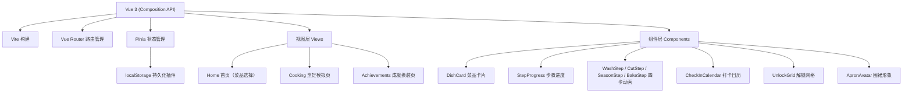

## 1. 架构设计

纯前端 SPA，无后端，所有数据通过 localStorage 本地持久化。



## 2. 技术描述

- **前端框架**：Vue 3.4（Composition API + `<script setup>`）
- **构建工具**：Vite 5.x
- **路由**：Vue Router 4.x（hash 模式，免后端配置）
- **状态管理**：Pinia 2.x + pinia-plugin-persistedstate（自动 localStorage 持久化）
- **样式方案**：原生 CSS + CSS Variables（主题色/间距/圆角），无需 Sass 等预处理器，降低依赖
- **动画方案**：Vue `<Transition>` + 原生 CSS Keyframes，复杂粒子用 JS 控制 DOM 插入
- **图标**：Emoji + 内联 SVG（厨房器具图标），零图标库依赖
- **字体**：Google Fonts CDN 加载 ZCOOL KuaiLe + Noto Sans SC
- **无后端**：所有数据本地存储

## 3. 目录结构

```
lyt-23/
├── index.html
├── package.json
├── vite.config.js
├── public/
│   └── favicon.svg
└── src/
    ├── main.js
    ├── App.vue
    ├── router/
    │   └── index.js
    ├── stores/
    │   └── cooking.js        # Pinia: 打卡天数、解锁记录、烹饪记录
    ├── data/
    │   ├── dishes.js         # 6 道菜的静态数据
    │   └── unlocks.js        # 解锁阈值与摆件/皮肤数据
    ├── views/
    │   ├── HomeView.vue
    │   ├── CookingView.vue
    │   └── AchievementsView.vue
    ├── components/
    │   ├── TopStatusBar.vue
    │   ├── DishCard.vue
    │   ├── cooking/
    │   │   ├── StepProgress.vue
    │   │   ├── WashStep.vue
    │   │   ├── CutStep.vue
    │   │   ├── SeasonStep.vue
    │   │   └── BakeStep.vue
    │   ├── FinishModal.vue
    │   ├── UnlockModal.vue
    │   └── achievements/
    │       ├── CheckInCalendar.vue
    │       ├── UnlockProgress.vue
    │       ├── DecorationGrid.vue
    │       └── ApronSelector.vue
    ├── utils/
    │   └── animation.js      # 粒子/通用动画工具函数
    └── styles/
        ├── main.css          # 全局样式 + CSS Variables
        └── animations.css    # 全局 keyframes
```

## 4. 路由定义

| Route | 页面 | 目的 |
|-------|------|------|
| `/` | HomeView | 首页：菜品选择 + 状态概览 |
| `/cooking/:dishId` | CookingView | 烹饪模拟页（携带菜品 ID） |
| `/achievements` | AchievementsView | 成就：打卡日历 + 换装 |

## 5. Pinia Store 数据模型

### `useCookingStore`（自动 localStorage 持久化）

```js
{
  totalDays: 0,              // 累计打卡天数
  streakDays: 0,             // 连续打卡天数
  lastCheckInDate: null,     // 上次打卡日期 ISO 'YYYY-MM-DD'
  checkInDates: [],          // 所有打卡日期数组 ['2026-06-01', ...]
  cookingHistory: [          // 烹饪记录
    { dishId, completedAt: ISOString, step: 'bake' }
  ],
  unlockedDecorations: [],   // 已解锁摆件 ID 列表
  unlockedAprons: ['default'], // 已解锁围裙 ID 列表，默认含基础款
  activeDecoration: null,    // 当前摆放的摆件 ID
  activeApron: 'default',    // 当前穿戴的围裙 ID
}
```

## 6. 静态数据定义

### `data/dishes.js` —— 6 道快手菜
```js
[
  { id: 'tomato-egg',    name: '番茄炒蛋',   emoji: '🍅', time: 10, difficulty: 1, ingredients: ['番茄','鸡蛋'], color: '#FF6B6B' },
  { id: 'miso-salmon',   name: '味噌烤三文鱼', emoji: '🐟', time: 15, difficulty: 2, ingredients: ['三文鱼','味噌'], color: '#FFA07A' },
  { id: 'veggie-pasta',  name: '时蔬意面',   emoji: '🍝', time: 15, difficulty: 2, ingredients: ['意面','西兰花'], color: '#A7C957' },
  { id: 'teriyaki-chicken', name: '照烧鸡腿', emoji: '🍗', time: 20, difficulty: 2, ingredients: ['鸡腿','酱油'], color: '#C97B3C' },
  { id: 'mushroom-soup', name: '奶油蘑菇汤', emoji: '🍄', time: 12, difficulty: 1, ingredients: ['蘑菇','奶油'], color: '#D4A373' },
  { id: 'avocado-toast', name: '牛油果吐司', emoji: '🥑', time: 8,  difficulty: 1, ingredients: ['吐司','牛油果'], color: '#88B04B' },
]
```

### `data/unlocks.js` —— 解锁阈值
```js
{
  decorations: [
    { id: 'cactus',     name: '治愈小仙人掌', emoji: '🌵', threshold: 3  },
    { id: 'cat-figure', name: '厨房猫咪摆件', emoji: '🐱', threshold: 7  },
    { id: 'herb-pot',   name: '罗勒香草盆',   emoji: '🌿', threshold: 14 },
    { id: 'vintage-lamp', name: '复古小台灯', emoji: '💡', threshold: 21 },
    { id: 'fridge-magnet', name: '冰箱贴套装', emoji: '🧲', threshold: 30 },
    { id: 'coffee-mug', name: '暖心马克杯',   emoji: '☕', threshold: 45 },
    { id: 'wreath',     name: '干花小花环',   emoji: '🌸', threshold: 60 },
  ],
  aprons: [
    { id: 'default',  name: '基础米白围裙', color: '#FFF8F0', stripe: null, threshold: 0  },
    { id: 'gingham',  name: '橙白格纹围裙', color: '#FF8C42', stripe: 'gingham', threshold: 5  },
    { id: 'stripe',   name: '抹茶条纹围裙', color: '#A7C957', stripe: 'stripe',  threshold: 10 },
    { id: 'denim',    name: '做旧牛仔围裙', color: '#6B8EAE', stripe: 'denim',   threshold: 20 },
    { id: 'cherry',   name: '樱桃印花围裙', color: '#E63946', stripe: 'cherry',  threshold: 35 },
    { id: 'rainbow',  name: '彩虹治愈围裙', color: '#F4A261', stripe: 'rainbow', threshold: 50 },
  ]
}
```

## 7. 性能与体验

- 首屏体积控制：所有依赖压缩后目标 < 200KB（gzip）
- 动画性能：CSS 动画优先使用 `transform` / `opacity`，避免 layout thrash
- 粒子动画限制：单场景最大粒子数 50 个，步骤完成后统一清理
- localStorage 体积：打卡记录最多保留 365 条，超量自动裁剪旧数据
- 错误容错：localStorage 不可用时降级到内存存储（不阻塞体验）
